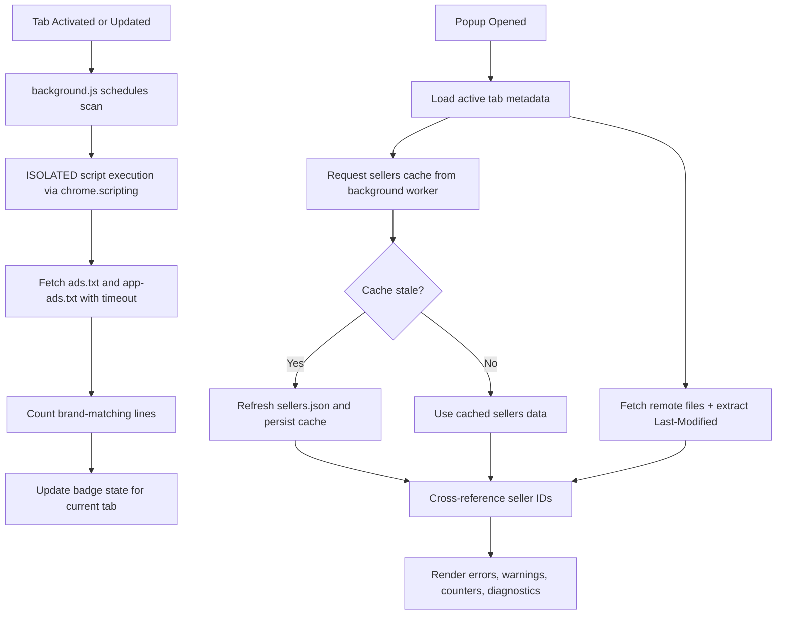

<a href="https://github.com/OstinUA" target="_blank" rel="noopener"></a>

> A zero-dependency Chrome Extension (Manifest V3) for AdOps engineers to validate `ads.txt` and `app-ads.txt` inventories, cross-reference seller IDs against a `sellers.json` registry, and surface syntax errors or configuration mismatches in real-time — directly in the browser.

[](manifest.json)
[](https://developer.chrome.com/docs/extensions/mv3/)
[](manifest.json)
[](https://iabtechlab.com/ads-txt/)
[](LICENSE)
[](https://github.com/OstinUA/ads.txt-app-ads.txt-sellers.json-Lines-Checker)

> [!NOTE]
> The project is intentionally lightweight: no npm runtime dependency graph is required to run the extension.

## Table of Contents

- [Title and Description](#adwmg-logging--validation-library)
- [Table of Contents](#table-of-contents)
- [Features](#features)
- [Tech Stack & Architecture](#tech-stack--architecture)
  - [Core Stack](#core-stack)
  - [Project Structure](#project-structure)
  - [Key Design Decisions](#key-design-decisions)
  - [Logging and Validation Pipeline](#logging-and-validation-pipeline)
- [Getting Started](#getting-started)
  - [Prerequisites](#prerequisites)
  - [Installation](#installation)
- [Testing](#testing)
- [Deployment](#deployment)
- [Usage](#usage)
- [Configuration](#configuration)
- [License](#license)
- [Contacts & Community Support](#contacts--community-support)

## Features

- High-signal validation pipeline for `ads.txt` and `app-ads.txt` records.
- Seller identity cross-reference against `sellers.json` with cached refresh semantics.
- Runtime diagnostics for malformed rows, mismatched domains, and missing seller IDs.
- HTTP freshness inspection using metadata like `Last-Modified`.
- Soft-404 and HTML-fallback detection for endpoints that return non-text payloads.
- Domain extraction and normalization helpers (`getBrandName`, `cleanDomain`, `safeHref`).
- Resilient network client with timeout + retry + backoff (`fetchWithTimeoutAndRetry`).
- Tab-scoped badge telemetry to surface current match counts at-a-glance.
- Overlay support for direct on-page inspection of `ads.txt`/`app-ads.txt` resources.
- Analyzer workspace for duplicate discovery and DIRECT/RESELLER ratio exploration.
- Isolated execution contexts separating background worker, content script, popup UI, and shared utilities.
- Security-aware CI posture with linting, SAST (CodeQL), and OpenSSF Scorecard workflows.

> [!IMPORTANT]
> The library logic is tuned for operational debugging in browser contexts; it is not a distributed crawler nor a replacement for backend compliance pipelines.

## Tech Stack & Architecture

### Core Stack

| Layer | Technology | Purpose |
|---|---|---|
| Primary Language | JavaScript (ES6+) | Core implementation for logging, validation, and utility primitives |
| Runtime Platform | Chrome Extension Manifest V3 | Event-driven service worker lifecycle and browser API surface |
| Browser APIs | `chrome.storage.local`, `chrome.scripting`, `chrome.action`, `chrome.tabs`, `chrome.runtime` | Caching, script injection, badge state, tab events, and inter-context messaging |
| UI Layer | HTML5 + CSS3 + Vanilla JS | Popup and analyzer UI surfaces |
| Security/Quality | GitHub Actions (`lint.yml`, `sast.yml`, `scorecard.yml`) | Static quality checks and security posture monitoring |
| Data Sources | `ads.txt`, `app-ads.txt`, `sellers.json` | Validation inputs and seller registry mapping |

### Project Structure

```text
ads.txt-app-ads.txt-sellers.json-Lines-Checker/
├── manifest.json
├── README.md
├── CONTRIBUTING.md
├── LICENSE
├── background/
│   └── background.js
├── content/
│   └── overlay.js
├── shared/
│   └── utils.js
├── ui/
│   ├── popup/
│   │   ├── popup.html
│   │   ├── popup.css
│   │   └── popup.js
│   └── analyzer/
│       ├── analyzer.html
│       ├── analyzer.css
│       └── analyzer.js
├── assets/
│   └── icons/
│       ├── icon128.png
│       └── iconlogo.png
├── docs/
│   └── extension-structure.md
├── scripts/
│   └── restructure_sources.sh
├── trigger action/
│   └── trigger_action.py
└── .github/
    └── workflows/
        ├── lint.yml
        ├── sast.yml
        ├── scorecard.yml
        ├── label-sync.yml
        ├── dependabot-auto-merge.yml
        └── ai-issue.yml
```

### Key Design Decisions

1. **MV3-first runtime model**: service worker logic is short-lived by design, so durable state is persisted in `chrome.storage.local`.
2. **Context isolation**: background worker, content script, popup UI, and analyzer UI remain decoupled to avoid privilege leakage.
3. **Shared utility contract**: domain parsing and network primitives are centralized in `shared/utils.js` to reduce duplicate logic.
4. **Graceful degradation**: retries, timeouts, and fallback fetch paths reduce false negatives under transient network failures.
5. **Tab-aware telemetry**: badge state is maintained per-tab, then updated on activation and navigation events.
6. **Manual QA + CI static analysis**: a practical strategy for browser extension workflows where runtime integration tests are difficult to fully automate.

> [!TIP]
> Keep new logging or validation logic in `shared/utils.js` whenever it can be reused by both `background` and `ui` contexts.

### Logging and Validation Pipeline



## Getting Started

### Prerequisites

- `Google Chrome` or Chromium-based browser with Manifest V3 support.
- `git` for cloning the repository.
- `node` 20+ for optional local JS syntax/lint checks.

> [!CAUTION]
> This extension requests broad host permissions (`http://*/*`, `https://*/*`) to inspect arbitrary inventory endpoints. Review and constrain this for hardened environments.

### Installation

```bash
# 1) Clone repository
git clone https://github.com/OstinUA/ads.txt-app-ads.txt-sellers.json-Lines-Checker.git

# 2) Enter project directory
cd ads.txt-app-ads.txt-sellers.json-Lines-Checker

# 3) Open Chrome extension manager
# Navigate to: chrome://extensions

# 4) Enable Developer mode

# 5) Click "Load unpacked"
# Select the repository root containing `manifest.json`
```

## Testing

The project currently favors targeted manual validation plus static checks.

### Unit Tests

> [!NOTE]
> There is no dedicated unit test harness committed in the repository at this time.

### Integration Tests (Manual)

Run these checks in browser runtime:

- Verify successful parsing/rendering of both `ads.txt` and `app-ads.txt`.
- Validate HTML soft-404 detection behavior for invalid text endpoints.
- Validate seller reconciliation by testing known matching and non-matching `seller_id` values.
- Verify `OWNERDOMAIN` / `MANAGERDOMAIN` consistency warnings.
- Verify tab badge count behavior after navigation, reload, and tab switching.

### Lint and Static Checks

```bash
# JavaScript syntax validation across extension source trees
find background content shared ui -type f -name '*.js' -print0 | xargs -0 -I{} node --check "{}"

# Optional npm-based lint if a script is added later
npm run lint --if-present
```

## Deployment

### Production Build and Release

1. Update `version` in `manifest.json`.
2. Reload extension in `chrome://extensions` and execute smoke tests.
3. Package and upload through Chrome Web Store release flow.
4. Document permission changes and behavioral impact in release notes.

### CI/CD Integration Guidance

- `lint.yml`: JavaScript formatting/lint/static hygiene.
- `sast.yml`: CodeQL-based static application security testing.
- `scorecard.yml`: OpenSSF supply-chain score monitoring.
- `dependabot-auto-merge.yml`: automated dependency update governance.

> [!WARNING]
> Any permission delta in `manifest.json` should be treated as a high-risk release event and gated with explicit reviewer sign-off.

### Containerization

- Runtime containerization is not required for extension execution.
- If desired for CI reproducibility, add a Docker image with `node` + lint toolchain and mount repo read-only where possible.

## Usage

### Initialize and Execute Validation Flow

```javascript
// Example: high-level popup flow for diagnostics + rendering
(async () => {
  // Resolve active tab domain (already discovered by popup runtime)
  const activeDomain = "example.com";

  // Fetch ads.txt with retry + timeout semantics
  const adsResponse = await fetchWithTimeoutAndRetry(
    `https://${activeDomain}/ads.txt`,
    { timeout: 10000, retries: 1 }
  );
  const adsText = await adsResponse.text();

  // Read cached sellers registry from background worker
  const cache = await chrome.runtime.sendMessage({ type: "getSellersCache" });

  // Render diagnostics into UI (project-specific renderer)
  renderResults({
    adsText,
    sellers: cache.sellers,
    fetchedAt: cache.ts
  });
})();
```

### Use Shared Utilities

```javascript
// Domain and URL normalization
const brand = getBrandName("https://adwmg.com/sellers.json"); // -> "adwmg"
const normalizedDomain = cleanDomain("https://www.Example.com/path?q=1"); // -> "example.com"
const safeUrl = safeHref("example.com"); // -> "https://example.com/"

// Fetch with timeout and retry for unstable upstream endpoints
const res = await fetchWithTimeoutAndRetry("https://example.com/app-ads.txt", {
  timeout: 8000,
  retries: 2
});
const text = await res.text();
```

### Trigger Sellers Cache Refresh

```javascript
// Force refresh of sellers cache from popup/analyzer context
const result = await chrome.runtime.sendMessage({ type: "refreshSellers" });

if (!result.ok) {
  // handle refresh failure in UI state
  showError("Unable to refresh sellers.json cache");
}
```

## Configuration

### Persistent Storage Keys (`chrome.storage.local`)

| Key | Type | Description |
|---|---|---|
| `custom_sellers_url` | `string` | User-defined override for the sellers registry endpoint |
| `adwmg_sellers_cache` | `array` | Cached value of `sellers.json.sellers` |
| `adwmg_sellers_ts` | `number` | Cache write timestamp in epoch milliseconds |

### Runtime Constants

| Constant | Default | Purpose |
|---|---|---|
| `DEFAULT_SELLERS_URL` | `https://adwmg.com/sellers.json` | Baseline sellers registry source |
| `SCAN_COOLDOWN_MS` | `60000` | Minimum time between scans per tab |
| `FETCH_TIMEOUT_MS` | `10000` | Network timeout for background fetches |
| `FETCH_RETRIES` | `3` | Retry attempts for resilient remote fetch |
| `FIXED_CACHE_TTL_MS` | `3600000` | Sellers cache validity window |
| `INITIAL_DELAY_MS` | `5000` | Delayed scan trigger after tab lifecycle events |
| `RETRY_INTERVAL_MS` | `5000` | Interval for retrying scans with zero matches |
| `MAX_RETRIES` | `3` | Maximum per-tab retry attempts |

### Environment Variables

No `.env` file is required for runtime operation.

### Startup Flags

No CLI startup flags are required.

### Manifest Configuration

Primary runtime settings are declared in `manifest.json`:

- `permissions`: extension capabilities (`tabs`, `storage`, `scripting`, `unlimitedStorage`).
- `host_permissions`: wildcard access for HTTP/HTTPS inventory retrieval.
- `background.service_worker`: event-driven worker entrypoint.
- `action.default_popup`: popup UI bootstrapping file.
- `content_scripts`: overlay injection rules for `ads.txt` and `app-ads.txt` URL patterns.

> [!IMPORTANT]
> Never commit sensitive values into source files. If release automation credentials are added later, keep them in GitHub Actions encrypted secrets only.

## License

This project is licensed under the GNU Affero General Public License v3.0 (`AGPL-3.0`). See [`LICENSE`](LICENSE) for full terms.

## Contacts & Community Support

## Support the Project

[](https://www.patreon.com/OstinFCT)
[](https://ko-fi.com/fctostin)
[](https://boosty.to/ostinfct)
[](https://www.youtube.com/@FCT-Ostin)
[](https://t.me/FCTostin)

If you find this tool useful, consider leaving a star on GitHub or supporting the author directly.
