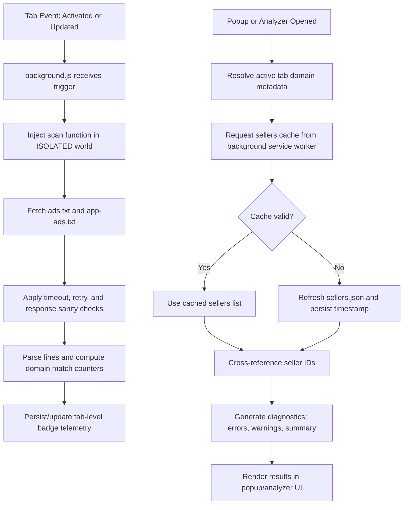

<a href="https://github.com/OstinUA" target="_blank" rel="noopener"></a>

> A zero-dependency Chrome Extension (Manifest V3) for AdOps engineers to validate `ads.txt` and `app-ads.txt` inventories, cross-reference seller IDs against a `sellers.json` registry, and surface syntax errors or configuration mismatches in real-time — directly in the browser.

[](manifest.json)
[](https://developer.chrome.com/docs/extensions/mv3/)
[](manifest.json)
[](https://iabtechlab.com/ads-txt/)
[](LICENSE)
[](https://github.com/OstinUA/ads.txt-app-ads.txt-sellers.json-Lines-Checker)

> [!NOTE]
> While the repository is packaged as a Chrome Extension (MV3), its core value is a reusable logging and validation pipeline implemented in JavaScript utilities and background orchestration logic.

> [!IMPORTANT]
> The project does not require runtime npm dependencies to execute; loading the unpacked extension in Chrome is sufficient for functional validation.

## Table of Contents

- [ADWMG Logging and Validation Library](#adwmg-logging-and-validation-library)
- [Table of Contents](#table-of-contents)
- [Features](#features)
- [Tech Stack & Architecture](#tech-stack--architecture)
  - [Core Stack](#core-stack)
  - [Project Structure](#project-structure)
  - [Key Design Decisions](#key-design-decisions)
  - [Architecture and Logging Pipeline](#architecture-and-logging-pipeline)
- [Getting Started](#getting-started)
  - [Prerequisites](#prerequisites)
  - [Installation](#installation)
- [Testing](#testing)
  - [Unit Testing](#unit-testing)
  - [Integration and Runtime Validation](#integration-and-runtime-validation)
  - [Linting and Static Analysis](#linting-and-static-analysis)
- [Deployment](#deployment)
  - [Production Release Workflow](#production-release-workflow)
  - [CI/CD Integration](#cicd-integration)
  - [Containerization Guidance](#containerization-guidance)
- [Usage](#usage)
  - [Initialize the Validation Session](#initialize-the-validation-session)
  - [Run Resilient Fetch and Record Diagnostics](#run-resilient-fetch-and-record-diagnostics)
  - [Cross-reference Seller Records](#cross-reference-seller-records)
  - [Trigger Cache Refresh on Demand](#trigger-cache-refresh-on-demand)
- [Configuration](#configuration)
  - [Storage-backed Configuration Keys](#storage-backed-configuration-keys)
  - [Runtime Constants](#runtime-constants)
  - [Environment Variables](#environment-variables)
  - [Startup Flags](#startup-flags)
  - [Manifest-driven Runtime Settings](#manifest-driven-runtime-settings)
- [License](#license)
- [Contacts & Community Support](#contacts--community-support)

## Features

- High-fidelity parsing and validation for both `ads.txt` and `app-ads.txt` sources.
- Real-time logging pipeline for syntax defects, malformed entries, and seller mismatch conditions.
- Seller registry reconciliation against `sellers.json` with cache lifecycle management.
- Retry-aware network fetch layer with timeout, bounded retry, and controlled backoff semantics.
- Tab-scoped diagnostics and badge telemetry for quick operator-level visibility.
- URL, domain, and brand normalization helpers for deterministic comparisons.
- Detection of soft-404 responses and non-text/HTML fallback payloads.
- Separation of concerns across background worker, popup runtime, analyzer UI, and content overlay script.
- Support for user-defined `sellers.json` endpoint override via persistent extension storage.
- Lightweight runtime model with zero mandatory third-party package dependencies.
- Secure-by-default project governance through CI workflows for linting, SAST (CodeQL), and OpenSSF score checks.
- Operationally focused design suitable for AdOps debugging workflows and pre-release inventory audits.

> [!TIP]
> Treat this project as a logging-first diagnostic toolkit: prioritize warning quality, contextual metadata, and reproducible operator output over broad crawler-style scraping behavior.

## Tech Stack & Architecture

### Core Stack

| Layer | Technology | Responsibility |
|---|---|---|
| Language | JavaScript (ES6+) | Core library logic, validators, fetch primitives, and UI orchestration |
| Runtime Host | Chrome Extension Manifest V3 | Event-driven execution model via service worker lifecycle |
| Browser APIs | `chrome.runtime`, `chrome.tabs`, `chrome.action`, `chrome.scripting`, `chrome.storage.local` | Inter-context messaging, tab events, badge updates, script injection, and persistent cache |
| UI | HTML5, CSS3, Vanilla JavaScript | Popup and analyzer diagnostic surfaces |
| Security/Quality | GitHub Actions (`lint.yml`, `sast.yml`, `scorecard.yml`) | Continuous static validation, security analysis, and supply-chain posture |
| Source Inputs | `ads.txt`, `app-ads.txt`, `sellers.json` | Canonical records used by validation and reconciliation pipeline |

### Project Structure

```text
ads.txt-app-ads.txt-sellers.json-Lines-Checker/
├── manifest.json
├── README.md
├── LICENSE
├── CONTRIBUTING.md
├── SECURITY.md
├── background/
│   └── background.js
├── shared/
│   └── utils.js
├── content/
│   └── overlay.js
├── ui/
│   ├── popup/
│   │   ├── popup.html
│   │   ├── popup.css
│   │   └── popup.js
│   └── analyzer/
│       ├── analyzer.html
│       ├── analyzer.css
│       └── analyzer.js
├── docs/
│   └── extension-structure.md
├── scripts/
│   └── restructure_sources.sh
├── trigger action/
│   └── trigger_action.py
└── .github/
    └── workflows/
        ├── lint.yml
        ├── sast.yml
        ├── scorecard.yml
        ├── label-sync.yml
        ├── dependabot-auto-merge.yml
        └── ai-issue.yml
```

### Key Design Decisions

1. **MV3-native lifecycle model**: transient background worker execution is aligned with persistent storage usage for durable cache and runtime state.
2. **Shared utility consolidation**: reusable primitives in `shared/utils.js` prevent drift between UI and background validation behavior.
3. **Context isolation for reliability and security**: background, popup, analyzer, and content scripts are decoupled and communicate through explicit messages.
4. **Network resilience over optimistic assumptions**: timeout + retry controls harden diagnostics against unstable upstream endpoints.
5. **Operator-first observability**: diagnostics are designed for AdOps workflows, with clear counters, warnings, and mismatch indicators.
6. **Static quality gates in CI**: linting and security workflows provide guardrails where full browser integration tests are not always deterministic.

> [!WARNING]
> This library is designed for interactive diagnostics and should not be considered a substitute for enterprise-scale backend crawling or compliance pipelines.

### Architecture and Logging Pipeline



## Getting Started

### Prerequisites

- `Google Chrome` (or Chromium variant) with Manifest V3 support.
- `git` for repository cloning and local version control operations.
- `node` `>=20` for optional syntax checks and future lint tasks.

> [!CAUTION]
> The extension requests broad host access (`http://*/*`, `https://*/*`) to inspect remote inventory files. Restrict permissions in forked deployments when operating under strict compliance controls.

### Installation

```bash
# 1) Clone the repository
git clone https://github.com/OstinUA/ads.txt-app-ads.txt-sellers.json-Lines-Checker.git

# 2) Enter the project directory
cd ads.txt-app-ads.txt-sellers.json-Lines-Checker

# 3) Open the extensions page in Chrome
# URL: chrome://extensions

# 4) Enable Developer mode

# 5) Click "Load unpacked" and select this repository root
# The selected folder must contain manifest.json
```

> [!TIP]
> Pin the extension after loading it so diagnostics are accessible in one click during iterative AdOps investigations.

## Testing

This project primarily uses static checks plus targeted in-browser runtime validation.

### Unit Testing

> [!NOTE]
> A dedicated unit-test harness is not currently committed. Existing quality checks are implemented via syntax validation and CI security/lint workflows.

### Integration and Runtime Validation

Perform the following checks against representative sites:

1. Open a domain with known-valid `ads.txt` and verify successful line parsing.
2. Open a domain with intentional malformed rows to verify warning/error emission.
3. Validate seller reconciliation for both existing and missing `seller_id` values.
4. Verify cache reuse and refresh behavior for `sellers.json`.
5. Confirm badge counter updates on tab switch, reload, and navigation transitions.
6. Verify `OWNERDOMAIN` and `MANAGERDOMAIN` mismatch diagnostics.

### Linting and Static Analysis

```bash
# JavaScript syntax checks across core source directories
find background content shared ui -type f -name '*.js' -print0 | xargs -0 -I{} node --check "{}"

# Optional npm lint entry point (runs only if configured)
npm run lint --if-present
```

## Deployment

### Production Release Workflow

1. Increment `version` in `manifest.json` according to release policy.
2. Reload the unpacked extension and execute smoke tests in `chrome://extensions`.
3. Verify key diagnostic scenarios in popup and analyzer surfaces.
4. Package and submit through the Chrome Web Store release process.
5. Publish release notes documenting behavioral or permission changes.

### CI/CD Integration

Current GitHub Actions workflows provide foundational controls:

- `lint.yml`: syntax/style hygiene and quality checks.
- `sast.yml`: CodeQL-backed static application security testing.
- `scorecard.yml`: OpenSSF Scorecard monitoring for supply-chain posture.
- `dependabot-auto-merge.yml`: controlled automation for dependency updates.
- `label-sync.yml` and `ai-issue.yml`: repository maintenance automation.

> [!IMPORTANT]
> Treat every `manifest.json` permission change as a high-risk release event requiring explicit reviewer sign-off and clear changelog communication.

### Containerization Guidance

- Containerization is optional because runtime execution occurs inside Chrome.
- If you need reproducible CI, create a lightweight Node-based image for static checks.
- Prefer read-only mounts in CI jobs and keep release credentials in platform secret stores.

## Usage

### Initialize the Validation Session

```javascript
// Resolve active domain and start a diagnostics session.
(async () => {
  const activeDomain = "example.com";

  const adsResponse = await fetchWithTimeoutAndRetry(
    `https://${activeDomain}/ads.txt`,
    { timeout: 10000, retries: 1 }
  );

  const adsText = await adsResponse.text();
  const sellerCache = await chrome.runtime.sendMessage({ type: "getSellersCache" });

  renderResults({
    adsText,
    sellers: sellerCache?.sellers || [],
    fetchedAt: sellerCache?.ts || Date.now()
  });
})();
```

### Run Resilient Fetch and Record Diagnostics

```javascript
// Retrieve app-ads.txt with retry guards for unstable upstreams.
const response = await fetchWithTimeoutAndRetry("https://example.com/app-ads.txt", {
  timeout: 8000,
  retries: 2
});

const appAdsText = await response.text();
logDiagnostics({
  target: "app-ads.txt",
  bytes: appAdsText.length,
  fetchedAt: new Date().toISOString()
});
```

### Cross-reference Seller Records

```javascript
// Normalize data for deterministic seller matching.
const brand = getBrandName("https://adwmg.com/sellers.json");
const domain = cleanDomain("https://www.Example.com/path?query=1");
const profileUrl = safeHref(domain);

const sellerMatch = sellers.find((entry) => entry.seller_id === "12345");
if (!sellerMatch) {
  addWarning(`Missing seller_id for ${brand} (${profileUrl})`);
}
```

### Trigger Cache Refresh on Demand

```javascript
// Explicitly refresh sellers cache from popup or analyzer context.
const refreshResult = await chrome.runtime.sendMessage({ type: "refreshSellers" });

if (!refreshResult?.ok) {
  showError("Unable to refresh sellers registry cache");
}
```

## Configuration

### Storage-backed Configuration Keys

| Key | Type | Description |
|---|---|---|
| `custom_sellers_url` | `string` | User-provided override for the default sellers registry endpoint |
| `adwmg_sellers_cache` | `array` | Cached value derived from `sellers.json.sellers` |
| `adwmg_sellers_ts` | `number` | Epoch timestamp (ms) of the last successful sellers cache write |

### Runtime Constants

| Constant | Default | Purpose |
|---|---|---|
| `DEFAULT_SELLERS_URL` | `https://adwmg.com/sellers.json` | Primary registry URL used for seller reconciliation |
| `SCAN_COOLDOWN_MS` | `60000` | Minimum interval between automatic tab scans |
| `FETCH_TIMEOUT_MS` | `10000` | Request timeout for remote text assets |
| `FETCH_RETRIES` | `3` | Retry attempts for fetch failures |
| `FIXED_CACHE_TTL_MS` | `3600000` | Cache time-to-live for sellers data |
| `INITIAL_DELAY_MS` | `5000` | Delay before first scan after tab lifecycle events |
| `RETRY_INTERVAL_MS` | `5000` | Retry interval when initial scans return zero matches |
| `MAX_RETRIES` | `3` | Maximum retry attempts for tab-level scan scheduling |

### Environment Variables

No `.env` file is required for baseline runtime behavior.

If CI augmentation is introduced, store any secrets in GitHub Actions encrypted secrets (for example, release tokens), never in repository plaintext.

### Startup Flags

There are no CLI startup flags required to run this project as a Chrome extension.

### Manifest-driven Runtime Settings

Key settings are controlled in `manifest.json`:

- `permissions`: extension capability scope such as `tabs`, `storage`, `scripting`, and `unlimitedStorage`.
- `host_permissions`: target URL access policy for fetching `ads.txt`, `app-ads.txt`, and `sellers.json`.
- `background.service_worker`: event-driven entrypoint for orchestration and cache handling.
- `action.default_popup`: popup UI bootstrap document.
- `content_scripts`: overlay injection behavior for matching URL patterns.

> [!WARNING]
> Avoid introducing unnecessary permission surface area in `manifest.json`; request only the minimum privileges required for the intended validation behavior.

## License

This project is licensed under the GNU Affero General Public License v3.0 (`AGPL-3.0`). See [`LICENSE`](LICENSE) for full legal terms and obligations.

## Contacts & Community Support

## Support the Project

[](https://www.patreon.com/OstinFCT)
[](https://ko-fi.com/fctostin)
[](https://boosty.to/ostinfct)
[](https://www.youtube.com/@FCT-Ostin)
[](https://t.me/FCTostin)

If you find this tool useful, consider leaving a star on GitHub or supporting the author directly.
