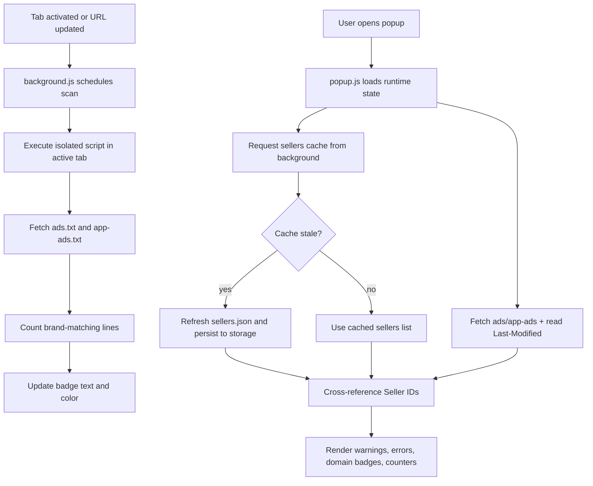

<a href="https://github.com/OstinUA" target="_blank" rel="noopener"></a>

> A zero-dependency Chrome Extension (Manifest V3) for AdOps engineers to validate `ads.txt` and `app-ads.txt` inventories, cross-reference seller IDs against a `sellers.json` registry, and surface syntax errors or configuration mismatches in real-time — directly in the browser.

[](manifest.json)
[](https://developer.chrome.com/docs/extensions/mv3/)
[](manifest.json)
[](https://iabtechlab.com/ads-txt/)
[](LICENSE)
[](https://github.com/OstinUA/ads.txt-app-ads.txt-sellers.json-Lines-Checker)

> [!NOTE]
> The project is intentionally lightweight: no npm runtime dependency graph is required to run the extension.

## Table of Contents

- [Title and Description](#adwmg-checker-ads-txt--app-ads-txt--sellersjson-validator)
- [Features](#features)
- [Tech Stack \\& Architecture](#tech-stack--architecture)
  - [Core Stack](#core-stack)
  - [Project Structure](#project-structure)
  - [Key Design Decisions](#key-design-decisions)
  - [Logging and Validation Pipeline](#logging-and-validation-pipeline)
- [Getting Started](#getting-started)
  - [Prerequisites](#prerequisites)
  - [Installation](#installation)
- [Testing](#testing)
- [Deployment](#deployment)
- [Usage](#usage)
- [Configuration](#configuration)
- [License](#license)
- [Contacts \\& Community Support](#support-the-project)

## Features

- Multi-source AdOps validation for `ads.txt`, `app-ads.txt`, and `sellers.json`.
- Domain brand extraction (`getBrandName`) from configurable `sellers.json` endpoint.
- Soft-404 detection for false-positive text files returned as HTML with `200 OK`.
- HTTP metadata extraction (`Last-Modified`) for operator-level freshness checks.
- `OWNERDOMAIN` and `MANAGERDOMAIN` consistency validation against active-tab domain.
- In-popup filtering to display only brand-matching lines or the complete data set.
- Seller ID reconciliation with warning-level annotations for missing registry entries.
- Critical error detection for commented-out data lines that crawlers would skip.
- Cached `sellers.json` retrieval in `chrome.storage.local` with TTL-based refresh logic.
- Retry-aware fetch pipeline with timeout controls and exponential backoff behavior.
- Dynamic extension badge updates based on per-tab line match counts.
- Overlay injector for direct `ads.txt` / `app-ads.txt` page inspection with contact/domain fields.
- Quick analyzer workspace for line statistics, duplicate detection, and DIRECT/RESELLER ratio insights.
- Zero external UI framework dependency; pure MV3 + Vanilla JavaScript execution model.

> [!IMPORTANT]
> The extension is designed for operational debugging and validation accuracy, not for server-side crawling. It executes in browser contexts and follows MV3 lifecycle constraints.

## Tech Stack & Architecture

### Core Stack

| Layer | Technology | Purpose |
|---|---|---|
| Language | JavaScript (ES6+) | Core runtime logic for popup, background worker, analyzer, and content script |
| Platform | Chrome Extension Manifest V3 | Browser extension runtime and permission model |
| Runtime APIs | `chrome.tabs`, `chrome.action`, `chrome.storage.local`, `chrome.scripting`, `chrome.runtime` | Tab lifecycle events, badge rendering, local persistence, script injection, messaging |
| UI | HTML5 + CSS3 | Popup and analyzer interfaces |
| Security/Quality | GitHub Actions + CodeQL + OpenSSF Scorecard | CI linting and static security analysis |
| Data Inputs | `ads.txt`, `app-ads.txt`, `sellers.json` | Validation targets and seller registry source |

### Project Structure

```text
ads.txt-app-ads.txt-sellers.json-Lines-Checker/
├── manifest.json
├── README.md
├── CONTRIBUTING.md
├── LICENSE
├── docs/
│   └── extension-structure.md
├── scripts/
│   └── restructure_sources.sh
├── background/
│   └── background.js
├── content/
│   └── overlay.js
├── shared/
│   └── utils.js
├── ui/
│   ├── popup/
│   │   ├── popup.html
│   │   ├── popup.css
│   │   └── popup.js
│   └── analyzer/
│       ├── analyzer.html
│       ├── analyzer.css
│       └── analyzer.js
├── assets/
│   └── icons/
│       ├── icon128.png
│       └── iconlogo.png
├── trigger action/
│   └── trigger_action.py
└── .github/
    └── workflows/
        ├── lint.yml
        ├── sast.yml
        ├── scorecard.yml
        └── ...
```

### Key Design Decisions

1. MV3-first architecture with ephemeral service worker state and explicit cache persistence.
2. Shared utility layer (`shared/utils.js`) used by both popup and background runtime.
3. Defensive network pipeline with timeout/retry controls to reduce flaky fetch failures.
4. Isolated-world script execution for page-context fetching and count extraction.
5. Tab-scoped badge state with cooldown + retry scheduling to avoid excessive scan churn.
6. Manual QA-first validation strategy suitable for extension UX + network edge-case testing.

> [!TIP]
> If you add new runtime features, keep concerns isolated by context (`background`, `popup`, `content`, `shared`) and avoid cross-context duplication.

### Logging and Validation Pipeline



## Getting Started

### Prerequisites

- Google Chrome or Chromium-based browser with Manifest V3 support.
- Git for cloning the repository.
- Optional: Node.js 20+ only if you intend to run repo-level lint scripts/workflows locally.

> [!CAUTION]
> Do not grant additional extension permissions unless strictly required. MV3 permission scope directly impacts user trust and review complexity.

### Installation

```bash
# 1) Clone repository
git clone https://github.com/OstinUA/ads.txt-app-ads.txt-sellers.json-Lines-Checker.git

# 2) Enter project folder
cd ads.txt-app-ads.txt-sellers.json-Lines-Checker
```

```text
# 3) In Chrome, open:
chrome://extensions

# 4) Enable "Developer mode"

# 5) Click "Load unpacked"
#    Select this repository root (the folder containing manifest.json)
```

## Testing

The repository currently emphasizes manual and CI static checks over full unit/integration harnesses.

### Manual Validation Matrix

- Validate successful fetch and line rendering for both `ads.txt` and `app-ads.txt`.
- Validate Soft-404 detection by testing a domain returning HTML content.
- Validate ID mismatch warnings by using a `sellers.json` without matching `seller_id`.
- Validate `OWNERDOMAIN` and `MANAGERDOMAIN` match/mismatch states.
- Validate custom `sellers.json` URL save + cache refresh flow.
- Validate badge update behavior across tab switches and refresh cycles.

### Local Commands

```bash
# JavaScript syntax validation (example for root-level extension folders)
find background content shared ui -type f -name '*.js' -print0 | xargs -0 -I{} node --check "{}"

# Optional lint (if package.json provides a lint script)
npm run lint --if-present
```

## Deployment

### Production Packaging (Manual)

1. Ensure `manifest.json` version is incremented.
2. Validate extension by reloading in `chrome://extensions`.
3. Package and publish through Chrome Web Store workflow (if applicable).

### CI/CD Integration

- `lint.yml`: lint/static checks and optional lockfile management.
- `sast.yml`: CodeQL scan across JavaScript/Python surfaces.
- `scorecard.yml`: OpenSSF scorecard analysis on schedule and on-demand.

> [!WARNING]
> Any change to `manifest.json` permissions should be treated as a high-impact deployment event and documented in PR notes.

### Docker / Compose

No Docker runtime is required for extension execution. If a containerized CI helper is introduced later, document image tags, volume mounts, and secure secrets handling in this section.

## Usage

### 1) Standard popup workflow

```javascript
// Popup bootstrap (conceptual flow)
(async () => {
  // Determine active tab and target domain
  const activeTabDomain = "example.com";

  // Fetch ads.txt data with soft-404 safeguards
  const ads = await fetchTxtFile(`https://${activeTabDomain}`, "ads.txt");

  // Read cached sellers.json from background service worker
  const sellers = await chrome.runtime.sendMessage({ type: "getSellersCache" });

  // Render cross-reference results into popup output
  renderResults(ads.text, sellers.sellers);
})();
```

### 2) Shared utility usage

```javascript
// shared/utils.js usage examples
const brand = getBrandName("https://adwmg.com/sellers.json"); // "adwmg"
const domain = cleanDomain("https://www.Example.com/path?q=1"); // "example.com"
const href = safeHref("example.com"); // "https://example.com/"

// Retry-aware fetch for unstable endpoints
const response = await fetchWithTimeoutAndRetry("https://example.com/ads.txt", {
  timeout: 8000,
  retries: 1
});
```

### 3) Analyzer workflow

```javascript
// Analyzer flow sketch
const adsResult = await fetchFile("example.com", "ads.txt");
const appadsResult = await fetchFile("example.com", "app-ads.txt");

const adsAnalysis = analyzeFile(adsResult.text);
const appadsAnalysis = analyzeFile(appadsResult.text);

renderColumn(adsContent, adsAnalysis, appadsAnalysis.keySet);
renderColumn(appadsContent, appadsAnalysis, adsAnalysis.keySet);
```

## Configuration

### Runtime storage keys (`chrome.storage.local`)

| Key | Type | Description |
|---|---|---|
| `custom_sellers_url` | `string` | User-defined sellers registry URL override |
| `adwmg_sellers_cache` | `array` | Cached sellers records (`sellers.json.sellers`) |
| `adwmg_sellers_ts` | `number` | Cache timestamp (epoch ms) |

### Internal constants (runtime behavior)

| Constant | Default | Scope |
|---|---|---|
| `DEFAULT_SELLERS_URL` | `https://adwmg.com/sellers.json` | Shared utility default |
| `SCAN_COOLDOWN_MS` | `60000` | Background scan cadence |
| `FETCH_TIMEOUT_MS` | `10000` | Background fetch timeout |
| `FETCH_RETRIES` | `3` | Background fetch retry count |
| `FIXED_CACHE_TTL_MS` | `3600000` | sellers cache TTL |
| `INITIAL_DELAY_MS` | `5000` | Initial delayed scan after events |
| `RETRY_INTERVAL_MS` | `5000` | Rescan interval |
| `MAX_RETRIES` | `3` | Max tab rescan attempts |

### Environment variables and startup flags

- No `.env` file is required.
- No startup CLI flags are required.
- All user-facing configuration is managed through popup settings and persisted locally.

> [!NOTE]
> If you later introduce CI secrets (e.g., store publishing credentials), keep them exclusively in GitHub Actions secrets and never commit plaintext values.

## License

This project is licensed under the GNU Affero General Public License v3.0 (`AGPL-3.0`). See [`LICENSE`](LICENSE) for the full legal text.

## Support the Project

[](https://www.patreon.com/OstinFCT)
[](https://ko-fi.com/fctostin)
[](https://boosty.to/ostinfct)
[](https://www.youtube.com/@FCT-Ostin)
[](https://t.me/FCTostin)

If you find this tool useful, consider leaving a star on GitHub or supporting the author directly.
