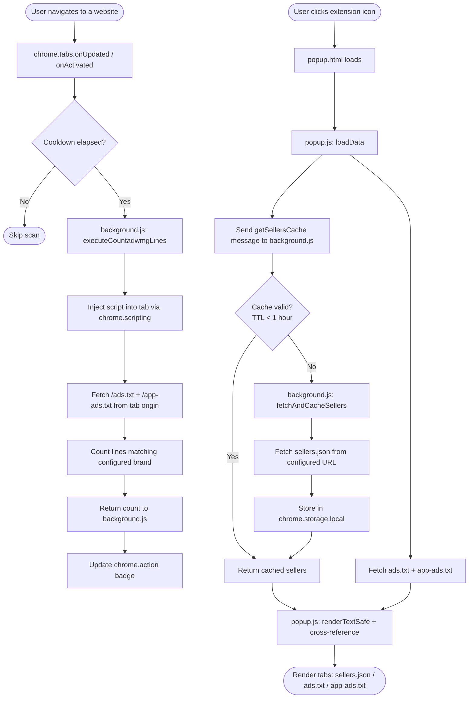

# adWMG Checker: ads.txt / app-ads.txt & sellers.json Validator

> A zero-dependency Chrome Extension (Manifest V3) for AdOps engineers to validate `ads.txt` and `app-ads.txt` inventories, cross-reference seller IDs against a `sellers.json` registry, and surface syntax errors or configuration mismatches in real-time — directly in the browser.

[](manifest.json)
[](https://developer.chrome.com/docs/extensions/mv3/)
[](manifest.json)
[](https://iabtechlab.com/ads-txt/)
[](LICENSE)
[](https://github.com/OstinUA/ads.txt-app-ads.txt-sellers.json-Lines-Checker)

---

## Table of Contents

- [Features](#features)
- [Tech Stack & Architecture](#tech-stack--architecture)
  - [Core Languages & Dependencies](#core-languages--dependencies)
  - [Project Structure](#project-structure)
  - [Key Design Decisions](#key-design-decisions)
  - [Data Flow Diagram](#data-flow-diagram)
- [Getting Started](#getting-started)
  - [Prerequisites](#prerequisites)
  - [Installation](#installation)
- [Testing](#testing)
- [Deployment](#deployment)
- [Usage](#usage)
- [Configuration](#configuration)
- [License](#license)
- [Support the Project](#support-the-project)

---

## Features

### Advanced Parsing & Validation

- **Smart Brand Name Extraction:** Intelligently derives the core brand name from complex `sellers.json` URLs — correctly handles multi-level subdomains (e.g., `api.applovin.com` → `applovin`, `cdn.pubmatic.com` → `pubmatic`) and country-code TLDs (e.g., `.co.uk`).
- **Soft 404 Detection:** Automatically identifies when a server returns an HTML error page with a `200 OK` status, masquerading as a plain-text file. Prevents false-positive validation results.
- **Syntax Error Highlighting:** Flags critical issues at the line level — including accidentally commented-out data lines (e.g., `# adwmg.com, 12345, DIRECT`) that IAB crawler logic would silently skip.
- **OWNERDOMAIN Validation:** Parses the `OWNERDOMAIN` field from `ads.txt` / `app-ads.txt` and validates it against the currently active tab's hostname. Returns one of three states: `MATCH`, `MISMATCH`, or `NOT FOUND`.
- **MANAGERDOMAIN Validation:** Same cross-check as OWNERDOMAIN, for the `MANAGERDOMAIN` field.
- **Last-Modified Header Display:** Reads and surfaces the `Last-Modified` HTTP response header to show when the file was last updated on the server.
- **Inline Contact Info Overlay:** A content script injected directly into raw `.txt` pages parses and renders `CONTACT`, `CONTACT-EMAIL`, `OWNERDOMAIN`, and `MANAGERDOMAIN` fields as a floating, dismissible overlay.

### sellers.json Cross-Reference Engine

- **Automated Registry Fetch:** Fetches `sellers.json` from a configurable URL (defaults to `https://adwmg.com/sellers.json`) using a resilient retry mechanism with per-attempt exponential back-off.
- **Local Caching with TTL:** Persists the fetched `sellers.json` payload in `chrome.storage.local` with a 1-hour TTL, eliminating redundant network requests across page loads.
- **Seller ID Discrepancy Detection:** For every `ads.txt` and `app-ads.txt` entry that matches the configured brand, the extension checks whether the extracted Seller ID is present in the cached `sellers.json` registry. Missing IDs are flagged with a `(!)` warning badge.
- **Matched Seller Record Rendering:** The dedicated `sellers.json` tab renders all seller registry records whose IDs appear in either `ads.txt` or `app-ads.txt`, with own-domain entries visually highlighted.

### Real-time Badge Counter

- **Dynamic Extension Badge:** The extension icon badge updates in real-time with the total count of matching lines found across both `ads.txt` and `app-ads.txt` for the configured SSP/brand.
- **Scan Cooldown & Retry Logic:** Prevents excessive resource usage via a 60-second per-tab scan cooldown and up to 3 automatic retry attempts (5-second intervals) to handle slow-loading sites.
- **Tab Lifecycle Management:** Badge state is independently tracked per-tab and cleaned up when tabs are closed, navigated away, or reloaded.

### UI & UX

- **Three-Tab Interface:** Separate, clearly labelled tabs for `sellers.json` matches, `ads.txt` analysis, and `app-ads.txt` analysis.
- **Live Line Counters:** Each tab header displays the exact count of valid (non-empty) lines fetched from the respective file.
- **Inline Status Badges:** Per-line visual indicators:
  - **(X)** — Critical syntax error (data line is commented out).
  - **(!)** — ID mismatch warning (Seller ID not found in `sellers.json`).
- **Brand Filter Toggle:** A one-click toggle to switch between showing all lines or only those matching the configured brand, with a live status indicator.
- **Configurable Settings Panel:** An in-popup settings drawer (accessible via `⠸`) to set a custom `sellers.json` URL and force-refresh the cache.
- **Direct File Links:** Clickable links to the resolved `ads.txt` and `app-ads.txt` URLs for the active site.
- **Zero External Dependencies:** Pure Vanilla JavaScript — no bundler, no framework, no CDN calls.

---

## Tech Stack & Architecture

### Core Languages & Dependencies

| Layer | Technology | Details |
|---|---|---|
| Language | JavaScript (ES6+) | Vanilla JS, modular IIFE and service worker patterns |
| Extension Platform | Chrome Extension Manifest V3 | Service Worker background, isolated content scripts |
| Chrome APIs | `chrome.scripting` | Injects analysis functions into the active tab's isolated world |
| Chrome APIs | `chrome.storage.local` | Persists `sellers.json` cache and user configuration |
| Chrome APIs | `chrome.action` | Controls dynamic badge text and color on the extension icon |
| Chrome APIs | `chrome.tabs` | Tracks tab lifecycle events for badge management |
| Styling | CSS3 | Custom Flexbox layout, CSS variables, dark/light mode compatibility |
| External Data | `sellers.json` (IAB Tech Lab format) | Fetched at runtime from a user-configurable URL |

> [!NOTE]
> This extension has **zero npm dependencies** and requires no build step. There is no bundler (webpack, esbuild, Rollup), no transpilation (Babel), and no type-checking toolchain. The source files are loaded directly by Chrome.

### Project Structure

```
ads.txt-app-ads.txt-sellers.json-Lines-Checker/
│
├── manifest.json          # Extension manifest (Manifest V3): permissions, entry points, content script matchers
├── background.js          # Service Worker: sellers.json fetch/cache, badge counter logic, tab event listeners
├── overlay.js             # Content Script: injects a floating "Domains Found" overlay onto raw .txt pages
├── popup.html             # Extension popup UI: three-tab layout, settings panel, output container
├── popup.css              # Popup styling: Flexbox layout, badge styles, dark/light theme compatibility, scrollbars
├── popup.js               # Core validation logic: file fetching, line parsing, sellers.json cross-reference, DOM rendering
├── utils.js               # Shared utilities: getBrandName(), cleanDomain(), safeHref(), fetchWithTimeoutAndRetry()
│
├── icons/
│   ├── icon128.png        # Extension icon (128×128) for Chrome Web Store and toolbar
│   └── iconlogo.png       # adWMG logo used in popup footer
│
├── .github/
│   ├── workflows/
│   │   ├── ai-issue.yml   # GitHub Actions: AI-powered issue triage automation
│   │   └── codeql.yml     # GitHub Actions: CodeQL static analysis for security scanning
│   ├── ISSUE_TEMPLATE/
│   │   ├── bug_report.yml
│   │   └── feature_request.yml
│   ├── dependabot.yml     # Dependabot configuration for automated dependency updates
│   ├── FUNDING.yml        # GitHub Sponsors / funding configuration
│   └── pull_request_template.md
│
├── CONTRIBUTING.md        # Contributor guide: setup, branch strategy, PR process, testing
└── LICENSE                # GNU Affero General Public License v3.0
```

### Key Design Decisions

**1. Manifest V3 Service Worker (not a persistent background page)**

Chrome Manifest V3 replaces persistent background pages with ephemeral Service Workers. `background.js` is structured accordingly: all state (`countsByTab`, `lastScanAt`, `scheduledTimers`) is held in in-memory objects, and the worker may be terminated and restarted by Chrome at any time. Cache persistence is delegated to `chrome.storage.local` precisely because Service Worker memory is non-durable.

**2. Isolated World Script Injection for File Fetching**

`ads.txt` and `app-ads.txt` are fetched by injecting an inline function into the tab's `ISOLATED` world via `chrome.scripting.executeScript`. This approach leverages the tab's existing session credentials and same-origin context to fetch resources that may not be accessible cross-origin from the extension's background context, while keeping execution sandboxed from the page's JavaScript.

**3. Centralized Utility Module (`utils.js`)**

All functions shared between the background Service Worker and the popup — `getBrandName()`, `cleanDomain()`, `safeHref()`, `fetchWithTimeoutAndRetry()` — are co-located in `utils.js`. The Service Worker loads it via `importScripts('utils.js')`, and the popup HTML loads it as a `<script>` tag before `popup.js`. This avoids code duplication without requiring a module bundler.

**4. Defensive Soft-404 Detection**

Many web servers return `200 OK` with an HTML error body when a file is not found. The extension performs a two-layer check: it first inspects the `Content-Type` response header, then independently scans the first 300 characters of the response body for HTML doctype/tag signatures. Both checks must pass before the content is treated as a valid `ads.txt` file.

**5. Per-Tab Badge State with Cooldown**

Each tab maintains its own scan timestamp (`lastScanAt`) and line count (`countsByTab`). A 60-second cooldown prevents the Service Worker from re-scanning a tab excessively on rapid URL changes. Tabs that fail to return match counts on the first scan are automatically retried up to 3 times at 5-second intervals, accommodating slow-loading pages.

### Data Flow Diagram



---

## Getting Started

### Prerequisites

| Requirement | Minimum Version | Notes |
|---|---|---|
| Google Chrome | 109+ | Manifest V3 support; Chromium-based browsers (Edge, Brave, Opera) are also compatible |
| Git | Any recent version | Only required for cloning the repository in developer mode |

> [!IMPORTANT]
> This extension does **not** require Node.js, npm, Python, or any other runtime. There is no build step. The source files are loaded directly by Chrome's extension engine.

### Installation

#### Option A — Developer Mode (Recommended for contributors)

```bash
# 1. Clone the repository
git clone https://github.com/OstinUA/ads.txt-app-ads.txt-sellers.json-Lines-Checker.git

# 2. Navigate to the project directory (no install step required)
cd ads.txt-app-ads.txt-sellers.json-Lines-Checker
```

```
# 3. Open Chrome and navigate to the extensions manager
chrome://extensions

# 4. Enable Developer Mode
#    Toggle the switch in the top-right corner of the extensions page

# 5. Load the unpacked extension
#    Click "Load unpacked" → select the cloned repository folder
#    (the folder that contains manifest.json)
```

The extension icon will appear in the Chrome toolbar. If it's not visible, click the puzzle-piece icon and pin the **adWMG Checker** extension.

#### Option B — Chrome Web Store

Install directly from the Chrome Web Store listing (if published) without any local setup.

> [!TIP]
> For day-to-day AdOps work, the Chrome Web Store installation is the most convenient. Use Developer Mode only when contributing or testing local changes.

---

## Testing

This project does not currently include an automated test runner or framework. All validation is performed through manual browser-based testing. The recommended test matrix covers the following scenarios:

### Manual Test Scenarios

| # | Scenario | Expected Result |
|---|---|---|
| 1 | Navigate to a site with a valid `ads.txt` containing the configured brand + matching seller IDs | Lines rendered in `ads.txt` tab; no warning badges; badge counter shows correct count |
| 2 | Navigate to a site with `ads.txt` where a seller ID is **missing** from `sellers.json` | Affected line rendered with `(!)` warning badge; tooltip reads "Warning: ID not found in sellers.json" |
| 3 | Navigate to a site where `ads.txt` contains a commented-out brand line (e.g., `# adwmg.com, 12345, DIRECT`) | Line rendered with `(X)` critical error badge; tooltip reads "Error: Data line is commented out!" |
| 4 | Navigate to a site that returns `404` or a Soft-404 HTML page for `ads.txt` | Error message displayed in `ads.txt` tab: "Error: ads.txt appears to be an HTML page (Soft 404)" |
| 5 | Navigate to a site with a mismatched `OWNERDOMAIN` field | `OWNER: MISMATCH` badge displayed in the status bar with a link to the declared domain |
| 6 | Navigate to a site where `ads.txt` is absent entirely | "File ads.txt not found (Network Error)" message in the `ads.txt` tab |
| 7 | Set a custom `sellers.json` URL in settings, save, and click "Cache" | Extension fetches from the new URL; brand filter updates to reflect the new brand name |
| 8 | Navigate directly to a raw `ads.txt` URL (e.g., `https://example.com/ads.txt`) | Content script overlay appears with `OwnerDomain`, `ManagerDomain`, `Contact` fields (if present) |

### Running Manual Tests

```
1. Load the extension in Developer Mode (see Installation).
2. Open Chrome DevTools → Extension background page inspector:
   chrome://extensions → adWMG Checker → "Service Worker" (inspect link)
3. Use the Console to observe background.js log output.
4. Navigate to target URLs and verify popup behavior against the test matrix above.
5. To test cache behavior: open DevTools → Application → Storage → chrome.storage.local
```

> [!TIP]
> Use sites like `nytimes.com`, `theguardian.com`, or any major publisher to find real-world `ads.txt` files with diverse content for testing. Use `chrome://extensions` → "Errors" to surface any runtime exceptions from the extension.

> [!NOTE]
> If you introduce automated tests (e.g., with Playwright Extension Testing, Jest + jsdom for `utils.js` unit tests, or Puppeteer), document the runner command in this section and in `CONTRIBUTING.md`.

---

## Deployment

### Developer Distribution (Unpacked)

For internal teams and contributors, load the extension in Developer Mode as described in the [Installation](#installation) section. This is suitable for QA, testing builds on staging environments, or evaluating unreleased feature branches.

### Chrome Web Store Publication

```
1. Zip the extension directory contents (do NOT include the .git folder):
   zip -r adwmg-checker-v6.6.0.zip . --exclude ".git/*" --exclude "*.md"

2. Log in to the Chrome Web Store Developer Dashboard:
   https://chrome.google.com/webstore/devconsole

3. Upload the .zip file as a new version submission.

4. Complete the Store Listing:
   - Short description (132 chars max)
   - Detailed description
   - Screenshots (1280×800 or 640×400)
   - Promotional images

5. Submit for review (typically 1–3 business days).
```

> [!IMPORTANT]
> Before submitting to the Chrome Web Store, verify that all permissions declared in `manifest.json` are strictly necessary. The current permissions are: `tabs`, `storage`, `scripting`. The `host_permissions` field grants access to all HTTP/HTTPS URLs — this is required for fetching `ads.txt` files from arbitrary publisher domains and for the `sellers.json` endpoint. Document the justification for all broad host permissions in the Store listing.

### CI/CD Pipeline (GitHub Actions)

The repository ships with two GitHub Actions workflows:

| Workflow | File | Trigger | Purpose |
|---|---|---|---|
| CodeQL Analysis | `.github/workflows/codeql.yml` | Push / PR to `main` | Static security analysis of JavaScript source files |
| AI Issue Triage | `.github/workflows/ai-issue.yml` | Issue opened | Automated triage and labelling of new GitHub Issues |

> [!NOTE]
> No build artifact is produced by CI. The extension is loaded directly from source. A release pipeline would consist of: run CodeQL → zip source → upload to Chrome Web Store via the [Chrome Web Store Publish API](https://developer.chrome.com/docs/webstore/using_webstore_api).

### Version Bumping

Version is declared in a single location:

```json
// manifest.json
{
  "version": "6.6.0"
}
```

Update the version string in `manifest.json` and create a corresponding Git tag before publishing a new release.

---

## Usage

### Basic Workflow

1. Navigate to any website in Chrome (e.g., `https://nytimes.com`).
2. The extension icon badge updates automatically with the count of matching lines found in `ads.txt` and `app-ads.txt` for the configured SSP brand.
3. Click the extension icon to open the popup.

### Popup Interface

The popup contains three tabs:

| Tab | Content |
|---|---|
| **sellers.json** | Seller registry records whose IDs appear in the site's `ads.txt` or `app-ads.txt`. Own-domain entries are highlighted. |
| **ads.txt** | Full content of the site's `ads.txt` file with syntax highlighting, warning badges, and domain validation status. |
| **app-ads.txt** | Same analysis pipeline applied to the site's `app-ads.txt` file for mobile app inventory. |

### Validation Logic (Annotated)

```javascript
// popup.js — renderTextSafe() — per-line validation logic

text.split("\n").forEach(line => {
  const trimmedLine = line.trim();
  if (trimmedLine.length === 0) return; // Skip blank lines

  // Only process lines relevant to the configured brand (e.g., "adwmg")
  if (trimmedLine.toLowerCase().includes(brand)) {

    const hasComma      = trimmedLine.includes(",");
    const startsSpecial = /^[^a-zA-Z0-9]/.test(trimmedLine);

    // CRITICAL ERROR: Line contains valid-looking data but starts with
    // a comment character (#, /, !, etc.). IAB crawlers will ignore it.
    if (startsSpecial && hasComma) {
      lineNode.classList.add("line-critical-error"); // Renders (X) badge
    }

    // SELLER ID CROSS-REFERENCE
    // Standard ads.txt format: domain, seller_id, relationship[, cert_authority]
    const parts   = trimmedLine.split(",").map(p => p.trim());
    const sellerId = parts[1]?.split(/\s+/)[0].replace(/[^a-zA-Z0-9]/g, "");

    if (sellerId && !isIdInSellers(sellerId)) {
      // sellersData is populated from the cached sellers.json registry
      lineNode.classList.add("line-warning"); // Renders (!) badge
    }
  }
});
```

### Domain Validation Status Badges

The status bar above the output area shows domain validation results:

```javascript
// popup.js — checkDomainField()

// Extracts the value of OWNERDOMAIN or MANAGERDOMAIN from the file text,
// then compares it (normalized, www-stripped) against the current tab's hostname.

// Possible return values:
// { status: "MATCH"     }  → declared domain matches the site's hostname
// { status: "MISMATCH"  }  → declared domain does not match (renders as a clickable link)
// { status: "NOT FOUND" }  → the field is absent from the file
```

### Inline Overlay on Raw `.txt` Pages

When you navigate directly to a raw `ads.txt` or `app-ads.txt` URL, `overlay.js` is injected as a content script and parses the page text for metadata fields, rendering a floating card:

```
┌──────────────────────────────────────────────┐
│ DOMAINS FOUND:                               │
│ OwnerDomain:    example.com                  │
│ ManagerDomain:  adtech-partner.com           │
├──────────────────────────────────────────────│
│ CONTACT INFO:                                │
│ Contact:        support.example.com          │
│ Contact-email:  adops@example.com            │
│                                            × │
└──────────────────────────────────────────────┘
```

---

## Configuration

This extension has no `.env` file and no external configuration files. All runtime configuration is stored in `chrome.storage.local` and managed through the in-popup settings panel.

### Settings Panel

Access via the `⠸` icon in the popup header.

| Setting | UI Element | Storage Key | Default Value | Description |
|---|---|---|---|---|
| `sellers.json` URL | Text input | `custom_sellers_url` | `https://adwmg.com/sellers.json` | The URL of the `sellers.json` registry to fetch and cross-reference against. Can be any valid IAB Tech Lab–formatted `sellers.json` endpoint. |
| Force Cache Refresh | "Cache" button | N/A | N/A | Bypasses the TTL check and immediately re-fetches `sellers.json` and re-loads `ads.txt` / `app-ads.txt` with `{ cache: "reload" }`. |

### Constants (Source-Level Configuration)

The following constants are defined in `background.js` and `utils.js`. Changing these requires editing source files and reloading the extension:

```javascript
// utils.js
const DEFAULT_SELLERS_URL = "https://adwmg.com/sellers.json"; // Default sellers.json endpoint
const CUSTOM_URL_KEY      = "custom_sellers_url";             // chrome.storage.local key

// background.js
const CACHE_KEY         = "adwmg_sellers_cache";   // storage key for sellers array
const CACHE_TS_KEY      = "adwmg_sellers_ts";      // storage key for cache timestamp
const BADGE_BG_COLOR    = "#21aeb3";               // hex color for the extension badge
const SCAN_COOLDOWN_MS  = 60 * 1000;               // minimum interval between tab scans (ms)
const FETCH_TIMEOUT_MS  = 10000;                   // HTTP request timeout (ms)
const FETCH_RETRIES     = 3;                       // retry attempts for sellers.json fetch
const FIXED_CACHE_TTL_MS = 1 * 60 * 60 * 1000;    // sellers.json cache TTL: 1 hour
const INITIAL_DELAY_MS  = 5000;                    // delay before first scan on tab load (ms)
const RETRY_INTERVAL_MS = 5000;                    // delay between retry scan attempts (ms)
const MAX_RETRIES       = 3;                       // maximum badge scan retry attempts per tab
```

### `manifest.json` Permissions

```json
{
  "permissions": [
    "tabs",        // Read tab URL and lifecycle events for badge management
    "storage",     // Persist sellers.json cache and custom URL setting
    "scripting"    // Inject file-fetching scripts into the active tab's isolated world
  ],
  "host_permissions": [
    "http://*/*",  // Required to fetch ads.txt from HTTP sites
    "https://*/*"  // Required to fetch ads.txt and sellers.json from HTTPS sites
  ]
}
```

> [!WARNING]
> The broad `host_permissions` (`http://*/*`, `https://*/*`) are required for the core functionality of fetching arbitrary publisher `ads.txt` files. Do not restrict these without thorough regression testing across all three tabs. Any modification to declared permissions resets the extension's Chrome Web Store review status.

> [!CAUTION]
> Changing `FIXED_CACHE_TTL_MS` to a very low value (e.g., under 5 minutes) will significantly increase network traffic to the `sellers.json` endpoint. The 1-hour default is intentional and aligns with typical `sellers.json` update cadences in the programmatic advertising ecosystem.

---

## License

This project is licensed under the **GNU Affero General Public License v3.0 (AGPL-3.0)**.

The AGPL-3.0 is a strong copyleft license. Key implications:

- You are free to use, modify, and distribute this software.
- If you distribute a modified version — including running it as a network service — you **must** release the complete corresponding source code under the same AGPL-3.0 license.
- Commercial use is permitted, provided the above copyleft obligations are met.

See the full license text in [LICENSE](LICENSE).

---

## Support the Project

[](https://www.patreon.com/OstinFCT)
[](https://ko-fi.com/fctostin)
[](https://boosty.to/ostinfct)
[](https://www.youtube.com/@FCT-Ostin)
[](https://t.me/FCTostin)

If you find this tool useful, consider leaving a star on GitHub or supporting the author directly.
